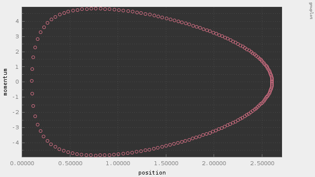
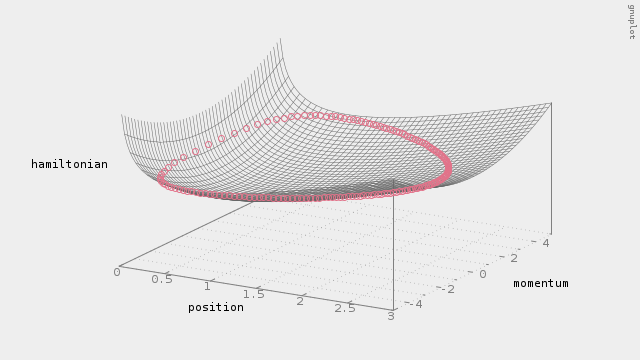
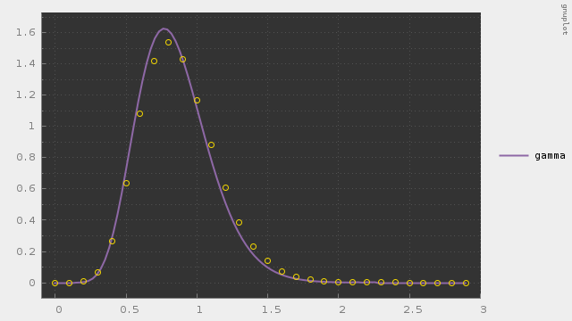

# hmc

Hamiltonian Monte Carlo method

---

#### これは何？

MCMCのハミルトニアンモンテカルロ法のC++によるフルスクラッチです。

##### 概要

メトロポリス・ヘイスティングス法の遷移にランダムウォークを採用した場合、移動距離を適切に設定しないといけないという問題があります。また、高次元空間では次元の呪いの影響で受容率が低くなるため、なかなか収束しないという問題もあります。ハミルトニアンモンテカルロ法はランダムウォーク系のMCMCとは違い、高次元空間でも平均移動距離を長く取ることができ、受容率も高くなるため、現実的な時間内に収束するのが特徴です。

メトロポリスヘイスティングス法に関してはこちら。
https://github.com/hiroyam/metropolis-hastings

##### 動作サンプル

リープフロッグ法で位相空間を遷移している様子をプロットしました。

ハミルトニアンを保存しながら遷移しているのが分かります。

d=1の場合のHMCとしてガンマ分布に従う乱数を発生させた例です。受容率は99%でした。

d=2の場合のHMCとして標本からガウス分布のパラメタを推定してみた例です。受容率は99%でした。

